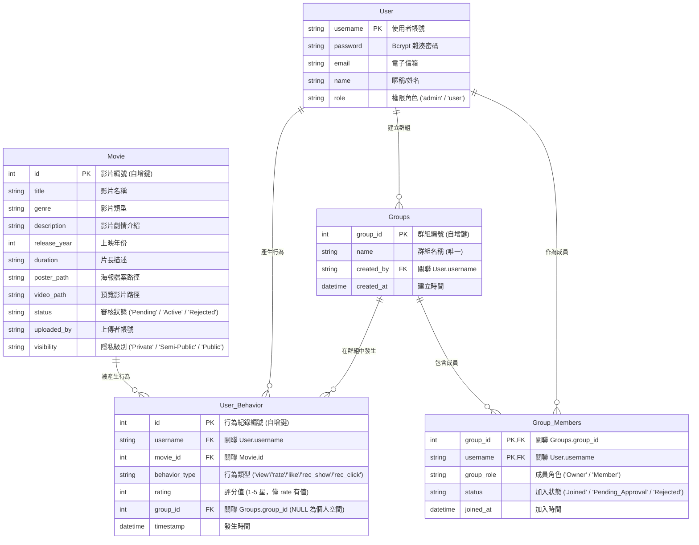

# 🍿 享Video - 智能影音推薦、社群群組與三級隱私控制系統

享Video 是一個基於 **Python + Streamlit + SQLite** 開發的高質感、反應式影音推薦與管理系統。本系統採用極致的深色科技風與磨砂玻璃質感 (Glassmorphic UI) 設計，完美整合了**一般用戶的影音大廳、個人影音上傳、群組社群管理前台**，以及**管理員的 BI 營運數據統計看板與影片審核後台**。

為了方便使用者在無須開啟終端機或手動輸入指令的情況下快速體驗，本系統在根目錄預載了**「一鍵點擊執行」的隨攜式啟動工具**。

---

## 🎯 期末專案 5 大核心目標對應

本專案在系統架構、資料庫與核心算法上，完美對應並達成了期末專案的 5 大指標需求：

### 1. 統一倉儲 (Unified Storage)
*   **設計目標**：告別傳統分散的試算表與文字檔，實現數據的中心化、結構化儲存。
*   **專案實作**：本系統設計了符合第三正規化 (3NF) 的 SQLite 關聯式資料庫 `data/recommender.db`。包含使用者資料 (`User`)、影片屬性 (`Movie`)、使用者互動行為日誌 (`User_Behavior`)，以及群組表 (`Groups`) 和成員表 (`Group_Members`)。所有的隱私授權判定、跨群組行為紀錄與群組加入審核，皆統一儲存於關聯式資料庫中。

### 2. 降低人工 (Reduced Human Labor)
*   **設計目標**：以系統自動化、智能化程序取代繁瑣的人工分析與環境部署。
*   **專案實作**：
    *   **一鍵懶人執行包**：內建 [啟動網頁.bat](file:///D:/Antigravity/Antigravity/啟動網頁.bat) 與 [點我一鍵安裝環境.bat](file:///D:/Antigravity/Antigravity/點我一鍵安裝環境.bat)，自動部署相依套件，兩下即可點擊執行。
    *   **私密影片免審核自動上架**：當使用者上傳影片並將隱私設為 `Private` 時，系統自動跳過管理員審核，狀態直接設為 `Active`，省去繁重的人力審核流程。
    *   **去中心化群組審核**：群組建立者（Owner）可自主在前端進行成員審核，不需依賴系統管理員手動進行資料庫修改。

### 3. AI 儀表板與安全過濾 (AI Dashboard & Analytics)
*   **設計目標**：將繁雜的資料庫底層紀錄轉化為具備商業洞察力的互動式看板，並維持嚴密的隱私隔離。
*   **專案實作**：
    *   後台管理介面整合了高解析度的 `Plotly` 互動式深色主題圖表（CTR 折線圖、評分分佈長條圖、類型圓餅圖）及行為日誌。
    *   **隱私安全隔離**：私密影片與未經核准的公開/半公開影片在資料庫查詢中被嚴格過濾。即使影片處於 `Active` 狀態，非上傳者之用戶在推薦、大廳瀏覽及後台待審清單中**皆絕對無法**獲取或觀看。

### 4. 資料驗證 (Data Validation & Quality)
*   **設計目標**：防範異常與垃圾資料寫入系統，保證倉儲資料之乾淨度與一致性。
*   **專案實作**：在管理員後台匯入 CSV 影片資料時，系統會先透過 `csv_validator.py` 使用 Pandas 進行嚴格的資料清洗與驗證（包含欄位結構、空值、上映年份整數值域檢驗等）。有錯誤時精準顯示行號，阻擋寫入 SQLite，保證資料乾淨度。

### 5. 多級 RBAC 權限與隱私控制 (Role-Based Access Control)
*   **設計目標**：依據不同使用者身分與關係，安全地劃分與控制系統的可存取頁面、群組及影音可視權限。
*   **專案實作**：
    *   **訪客參觀模式 (Guest)**：提供「免登入參觀」入口。訪客僅可瀏覽及播放 `Public`（公開）影音大廳，隱藏所有互動與管理按鈕。
    *   **一般用戶 (User)**：可瀏覽大廳、自建或申請加入群組、上傳個人影音（可設定隱私級別為 `Private`、`Semi-Public` 或 `Public`）、評分影片。
    *   **群組 Owner**：在其建立的群組中享有 `Owner` 角色，可在「群組空間管理 ➡️ 成員申請審核」中一鍵「同意」或「拒絕」新成員加入。
    *   **管理員 (Admin)**：享有完整 BI 數據統計看板、影片庫管理（手動/CSV 批次匯入），並可於「影片審核後台」審核一般用戶上傳的公開或半公開影片。

---

## 🔒 三級影片隱私可視規則

系統在 SQL 查詢層與 UI 渲染層，嚴格執行以下三級隱私控制規則：

1.  **私密 (Private)**：僅限「上傳者本人」登入時才可在網頁大廳或「🔒 只顯示我上傳的影片」中讀取與觀看。
2.  **半公開 (Semi-Public)**：僅限「上傳者本人」以及與上傳者「共同處於同一個已核准 Joined 群組」的成員登入時才可以看見與觀看。
3.  **公開 (Public)**：所有註冊用戶與未登入訪客（Guest Mode）皆可在影音大廳直接搜尋與播放（需處於 `Active` 狀態）。

---

## 📊 資料庫 ER 圖

---

## 🚀 Windows 一鍵啟動與安裝教學

為簡化操作，我們已在專案根目錄為您包裝好一鍵啟動的批次檔：

*   **第一次使用**：
    *   在專案目錄中，滑鼠按兩下 **`點我一鍵安裝環境.bat`**。
    *   這將會自動執行 `pip install -r requirements.txt`，確保所有 Python 依賴環境完全安裝就緒。
*   **啟動系統**：
    *   滑鼠按兩下 **`啟動網頁.bat`**。
    *   系統會自動在瀏覽器開啟大廳首頁（`http://localhost:8501`）。

---

## 🔑 預設測試帳號與資料配置

資料庫中已為您配置了豐富的測試資料：

| 帳號 (Username) | 密碼 (Password) | 權限身分 | 預載之體驗特色 |
| :--- | :--- | :--- | :--- |
| **`admin`** | `admin123` | 系統管理員 | KPI 營運看板、Plotly 數據圖表、用戶行為日誌、手動/CSV 批次新增影片，以及 **影片審核面板**。 |
| **`user1`** | `user123` | 一般用戶 | 參與了「電影研究社」與「搞笑短影音同好會」等群組。登入後可切換活動群組觀看對應推薦，且預載了其上傳的 **私密影片** 與 **半公開影片** 進行權限展示。 |
| **`user2`** | `user234` | 一般用戶 | 加入了「電影研究社」與「動漫與奇幻世界」群組。 |
| **`user3`** | `user345` | 一般用戶 | 加入了「搞笑短影音同好會」與「驚悚懸疑同好會」。申請加入「電影研究社」處於 **待審核 (Pending_Approval)** 狀態，供管理員/群主審核。 |
| **`user4`** | `user456` | 一般用戶 | 加入了「電影研究社」、「驚悚懸疑同好會」與「動漫與奇幻世界」。 |
| **`user5`** | `user567` | 一般用戶 | 加入了「搞笑短影音同好會」與「動漫與奇幻世界」。 |
